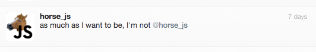

EXERCISE 1
==========
We would like for you to complete a short coding exercise for us (detailed below) which will give us an opportunity to see your approach to solving problems and some of your code on a clean build project. Please treat this as a real feature request, and submit work you would be happy submitting to a client. We recommend candidates limit the time spent on this exercise to around 3 hours.

We would like the candidate to build a simple web or command line application, which should allow users to enter an arbitrary GitHub username, and be presented with a best guess of the GitHub user's favourite programming language (ideally RoR).
This can be computed by using the GitHub API to fetch all of the user's public GitHub repos, each of which includes the name of the dominant language for the repository.
Documentation for the GitHub API can be found at http://developer.github.com.

EXERCISE 2
==========
Implement the following design in HTML and CSS

